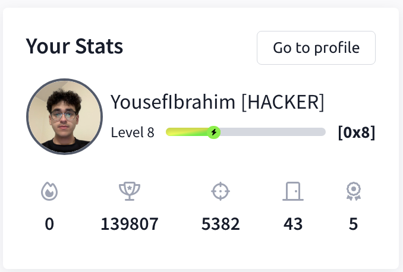

# 🧠 TryHackMe Progress  
**By Yousef Ibrahim**

This repository tracks my hands-on cybersecurity learning journey through [TryHackMe](https://tryhackme.com/), where I've completed guided labs and real-world security challenges.

---

## 🔎 Why TryHackMe?

I'm using TryHackMe to build practical skills in:
- Penetration testing
- Network defense
- Active Directory exploitation
- SIEM monitoring
- Web and system vulnerabilities

These rooms complement my coursework in Cybersecurity at Marist University and my homelab experiments.

---

## 📈 Current Stats

  
*Click the image — or [click here](https://tryhackme.com/p/YousefIbrahim) — to view my public profile*

---

## ✅ Notable Modules & Rooms Completed

- **Cyber Defense Frameworks**
- **Cryptography**
- **Compromising Active Directory**
- **Network Security Monitoring**
- **Metasploit**
- **Splunk 1**
- **Splunk 2**

---

## 📂 Screenshots Folder

All TryHackMe progress screenshots can be found in the `/Screenshots` directory:
- `tryhackme-stats.png` (dashboard overview)
- [Optional: add more screenshots later, like room badges or
